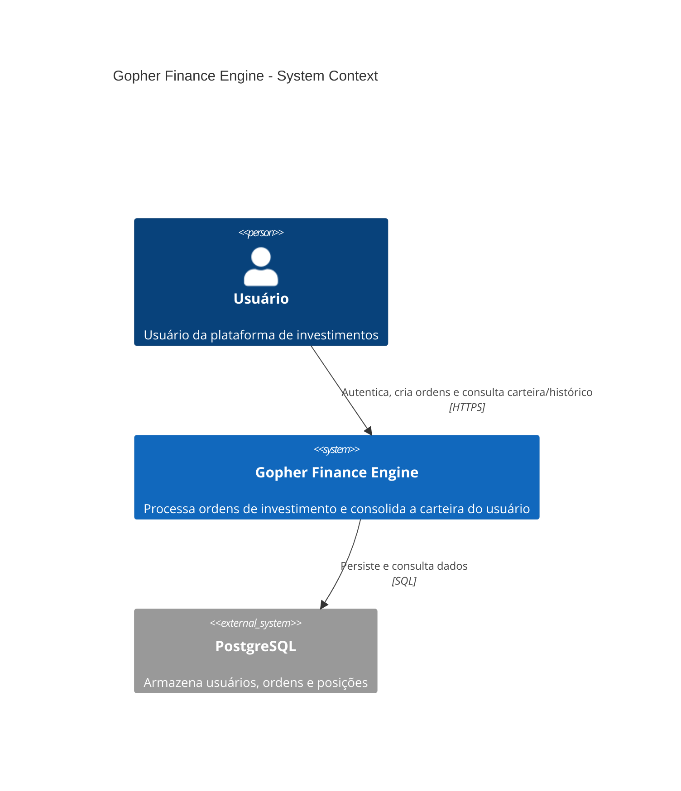
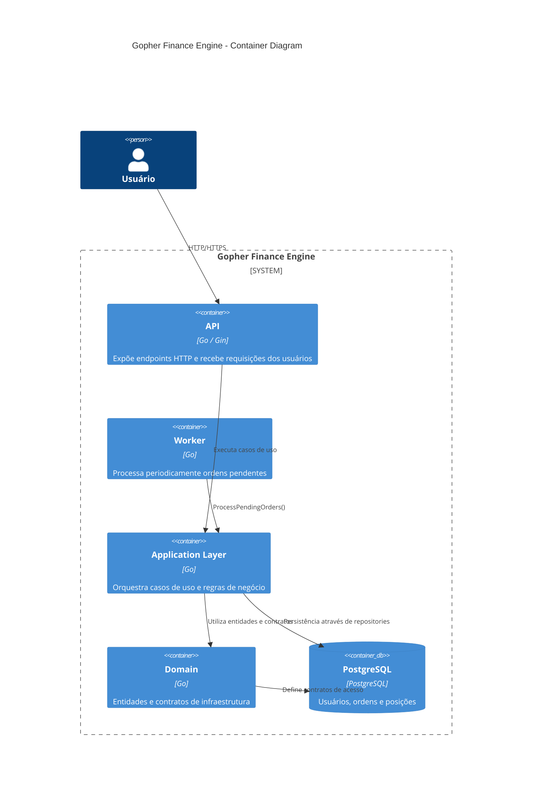

# Architecture

## Visão Geral

O **Gopher Finance Engine** é uma aplicação backend desenvolvida em Go para simular o processamento de ordens de investimento e a consolidação da carteira de usuários.

O projeto foi estruturado seguindo princípios de **Clean Architecture**, buscando separar regras de negócio, casos de uso e detalhes de infraestrutura.

O sistema possui dois fluxos principais:

1. **Fluxo síncrono HTTP**, responsável por autenticação, criação e consulta de dados.
2. **Fluxo assíncrono de processamento**, responsável por processar ordens pendentes e atualizar a carteira do usuário.

O objetivo arquitetural é permitir que as regras de negócio permaneçam independentes de HTTP, PostgreSQL ou mecanismos de execução.

---

# C4 Model

O C4 Model é utilizado para representar o sistema em diferentes níveis de abstração.

## C1 — System Context

Representação do sistema em relação aos usuários e sistemas externos.



### Contexto

O usuário interage diretamente com o **Gopher Finance Engine** através da API HTTP.

O sistema utiliza o PostgreSQL como mecanismo de persistência.

O processamento das ordens acontece internamente através de um Worker, não sendo necessário que o usuário aguarde o processamento durante a criação da ordem.

---

# C2 — Container Diagram

O nível de Container representa os principais componentes executáveis e responsabilidades do sistema.



> O diagrama representa os principais limites arquiteturais. O acesso ao PostgreSQL é realizado concretamente pela camada de infraestrutura através das implementações dos repositories.

---

# Arquitetura Geral

```text
                           ┌──────────────────┐
                           │      CLIENT      │
                           └────────┬─────────┘
                                    │
                                  HTTP
                                    │
                           ┌────────▼─────────┐
                           │    WEB / GIN     │
                           │    Handlers      │
                           └────────┬─────────┘
                                    │
                                    ▼
                    ┌─────────────────────────────┐
                    │      APPLICATION LAYER      │
                    │                             │
                    │  Users   Orders   Positions │
                    │                 │            │
                    │              Strategy       │
                    │                 │            │
                    │          PositionService    │
                    └──────────────┬──────────────┘
                                   │
                                   ▼
                    ┌─────────────────────────────┐
                    │        DOMAIN LAYER         │
                    │                             │
                    │ Entities + Repository       │
                    │ Contracts                   │
                    └──────────────┬──────────────┘
                                   │
                                   ▼
                    ┌─────────────────────────────┐
                    │     INFRASTRUCTURE LAYER    │
                    │                             │
                    │ PostgreSQL Repository       │
                    │ HTTP / Middleware           │
                    └──────────────┬──────────────┘
                                   │
                                   ▼
                           ┌───────────────┐
                           │  PostgreSQL   │
                           └───────────────┘


                           ┌─────────────────┐
                           │     WORKER      │
                           │   15 seconds    │
                           └────────┬────────┘
                                    │
                                    ▼
                            ProcessPendingOrders()
```

---

# Estrutura do Projeto

```text
cmd/
├── api/
│   └── main.go
│
└── worker/
    └── main.go

configs/

docs/
├── adr/
├── architecture/
├── backlog/
└── pull-requests/

internal/
│
├── application/
│   ├── users/
│   ├── orders/
│   ├── positions/
│   │   └── service/
│   ├── strategy/
│   └── engine/
│
├── domain/
│   ├── entity/
│   └── infra/
│       └── repository/
│
├── infra/
│   ├── repository/
│   └── web/
│       └── routes/
│
└── utils/

pkg/
└── postgres/
```

A organização dos módulos busca refletir as responsabilidades do sistema.

Os módulos de `users`, `orders` e `positions` representam capacidades distintas da aplicação, evitando concentrar todos os casos de uso em um único pacote.

---

# Camadas

## Application

A Application Layer contém os casos de uso e a orquestração do sistema.

```text
application/
├── users/
├── orders/
├── positions/
│   └── service/
├── strategy/
└── engine/
```

### Responsabilidades

* executar casos de uso;
* aplicar regras de negócio;
* coordenar diferentes módulos;
* selecionar estratégias de processamento;
* controlar o fluxo de processamento de ordens.

A Application não deve depender diretamente de detalhes de implementação da infraestrutura.

---

# Domain

A Domain Layer contém as entidades e contratos utilizados pela aplicação.

```text
domain/
├── entity/
└── infra/
    └── repository/
```

### Entities

Representam os conceitos centrais do domínio:

* User
* Order
* Position

### Repository Contracts

Definem as operações necessárias para persistência sem conhecer como elas são implementadas.

Exemplo:

```text
OrdersRepositoryI
PositionsRepositoryI
UsersRepositoryI
```

A Application depende dessas abstrações.

---

# Infrastructure

A Infrastructure Layer contém implementações concretas.

```text
infra/
├── repository/
└── web/
    └── routes/
```

### Repository

Implementa os contratos definidos pelo Domain.

```text
Application
      │
      ▼
Repository Interface
      │
      ▼
PostgreSQL Repository
      │
      ▼
PostgreSQL
```

### Web

Responsável pela entrada HTTP:

```text
Request
   │
   ▼
Middleware
   │
   ▼
Handler
   │
   ▼
Usecase
```

Handlers não possuem regras de negócio.

---

# Fluxo HTTP

```text
HTTP Request
     │
     ▼
Gin Router
     │
     ▼
Authentication Middleware
     │
     ▼
Handler
     │
     ▼
Usecase
     │
     ▼
Repository Interface
     │
     ▼
Repository Implementation
     │
     ▼
PostgreSQL
```

O fluxo permite que a API seja responsável apenas pela comunicação externa enquanto a Application permanece independente do protocolo HTTP.

---

# Fluxo de Criação de Ordem

A criação da ordem é síncrona apenas até sua persistência.

```text
POST /v1/orders
        │
        ▼
Authentication
        │
        ▼
CreateOrders
        │
        ▼
OrderUsecase
        │
        ▼
Create Order
        │
        ▼
Status = PENDING
        │
        ▼
PostgreSQL
        │
        ▼
HTTP 202
```

O processamento financeiro não acontece durante essa requisição.

A ordem é persistida como `PENDING` e posteriormente processada pelo Worker.

---

# Fluxo de Processamento

```text
Worker
   │
   ▼
ProcessPendingOrders()
   │
   ▼
Buscar ordens PENDING
   │
   ▼
┌─────────────────────┐
│ Para cada ordem     │
└──────────┬──────────┘
           │
           ▼
Buscar Position
           │
           ▼
     Existe posição?
       /          \
     NÃO           SIM
      │             │
      ▼             ▼
Criar Position   Utilizar Position
      │             │
      └──────┬──────┘
             ▼
       Selecionar Strategy
             │
       ┌─────┴─────┐
       ▼           ▼
      BUY         SELL
       │           │
       ▼           ▼
 Atualizar PM   Validar quantidade
       │           │
       │           ▼
       │       Atualizar posição
       │
       ▼
   Atualizar posição
       │
       ▼
Marcar ordem como PROCESSED
```

---

# Worker

O Worker é responsável por disparar o processamento das ordens pendentes.

```text
cmd/worker
     │
     ▼
application.NewWorker()
     │
     ▼
engine.Worker
     │
     ▼
Start(ctx)
     │
     ▼
ProcessPendingOrders()
     │
     ▼
Ticker: 15 segundos
     │
     └───────────────► próximo ciclo
```

O Worker possui ciclo contínuo e pode ser encerrado através de `context.Context`.

```text
Start
 │
 ├── processa imediatamente
 │
 ├── aguarda ticker
 │
 ├── processa novamente
 │
 ├── aguarda ticker
 │
 └── ...
```

O Worker não implementa a regra financeira.

Sua responsabilidade é **quando executar**.

A responsabilidade sobre **como processar** permanece na Application.

---

# Orders

O módulo de Orders é responsável por:

* criação de ordens;
* consulta do histórico;
* processamento de ordens pendentes;
* atualização do status.

O processamento é centralizado em:

```text
ProcessPendingOrders()
```

Esse caso de uso coordena o fluxo, mas delega regras específicas para estratégias.

---

# Strategy Pattern

O processamento de BUY e SELL foi separado através de Strategy.

```text
                    Order.Side
                        │
               ┌────────┴────────┐
               │                 │
              BUY               SELL
               │                 │
               ▼                 ▼
        BuyStrategy        SellStrategy
               │                 │
               ▼                 ▼
        Atualiza posição    Valida quantidade
        / calcula PM        / atualiza posição
               │                 │
               └────────┬────────┘
                        ▼
                 PositionService
                        │
                        ▼
                 PositionUsecase
                        │
                        ▼
                  Repository
```

O objetivo é evitar que o processamento principal concentre todas as regras em um grande `switch`.

Novas estratégias podem ser adicionadas sem modificar toda a estrutura do processamento.

---

# Position Service

O `PositionService` funciona como uma fronteira entre módulos.

```text
Orders
   │
   ▼
PositionService
   │
   ▼
PositionUsecase
   │
   ▼
PositionRepository
```

O módulo de Orders não precisa conhecer:

* contratos de persistência;
* implementação do repository;
* detalhes de atualização da posição.

Isso reduz o acoplamento entre módulos.

---

# Regra de Preço Médio

O preço médio da posição é uma regra de negócio e permanece fora do repository.

Para uma compra:

```text
Novo PM =
(
    PM atual × quantidade atual
    +
    preço da nova ordem × quantidade da nova ordem
)
/
(
    quantidade atual + quantidade da nova ordem
)
```

O repository é responsável apenas por persistir o resultado calculado pela Application.

Essa separação evita que regras de negócio sejam incorporadas ao SQL.

---

# Fluxo de Compra

```text
BUY
 │
 ▼
Buscar posição
 │
 ├── não existe
 │      │
 │      ▼
 │   criar posição
 │
 └── existe
        │
        ▼
   calcular novo PM
        │
        ▼
   atualizar quantidade
        │
        ▼
   persistir posição
        │
        ▼
   marcar ordem PROCESSED
```

---

# Fluxo de Venda

```text
SELL
 │
 ▼
Buscar posição
 │
 ▼
Validar quantidade disponível
 │
 ├── insuficiente
 │      │
 │      ▼
 │    erro
 │
 └── suficiente
        │
        ▼
   atualizar quantidade
        │
        ▼
   persistir posição
        │
        ▼
   marcar ordem PROCESSED
```

---

# Autenticação

As rotas protegidas utilizam middleware de autenticação.

```text
Request
   │
   ▼
AuthMiddleware
   │
   ├── token inválido → 401
   │
   └── token válido
           │
           ▼
       user_id
           │
           ▼
        Handler
```

O `user_id` autenticado é utilizado pela aplicação para garantir que recursos pertencem ao usuário autenticado.

Rotas protegidas incluem:

```text
POST /v1/orders
GET  /v1/portfolio
GET  /v1/historico
```

---

# Histórico de Ordens

O histórico utiliza o usuário autenticado como filtro.

```text
GET /v1/historico
        │
        ▼
AuthMiddleware
        │
        ▼
user_id
        │
        ▼
OrdersUsecase
        │
        ▼
GetAllOrdersByUserId()
        │
        ▼
OrdersRepository
        │
        ▼
PostgreSQL
```

O usuário não precisa informar seu próprio ID na URL.

---

# Carteira

A carteira é consolidada por:

```text
user_id + symbol
```

Uma posição representa a quantidade e o preço médio de determinado ativo pertencente ao usuário.

Exemplo:

```text
User
 ├── PETR4
 │    ├── TotalAmount
 │    └── AveragePrice
 │
 ├── VALE3
 │    ├── TotalAmount
 │    └── AveragePrice
 │
 └── BTC
      ├── TotalAmount
      └── AveragePrice
```

---

# Responsabilidades

## Handler

Responsável por:

* receber HTTP request;
* extrair dados;
* utilizar contexto;
* retornar HTTP response;
* delegar autenticação ao middleware.

Não deve conter regras de negócio.

---

## Usecase

Responsável por:

* executar casos de uso;
* aplicar regras de negócio;
* orquestrar módulos;
* controlar o fluxo da operação.

É a principal camada de aplicação.

---

## Service

Responsável por fornecer operações de um módulo para outros módulos sem expor detalhes internos.

Exemplo:

```text
Orders
   │
   ▼
PositionService
```

---

## Strategy

Responsável por encapsular uma variação específica de uma regra de negócio.

Exemplo:

```text
BUY  → BuyStrategy
SELL → SellStrategy
```

---

## Repository

Responsável por persistência.

Operações esperadas:

```text
Create
Read
Update
Delete
```

O repository não deve decidir regras financeiras.

---

## Worker

Responsável por:

* execução em background;
* periodicidade;
* disparo do processamento;
* lifecycle através de context.

Não deve conter regras financeiras.

---

# Dependências Arquiteturais

A direção das dependências segue o princípio de depender de abstrações.

```text
                ┌───────────────┐
                │ Application   │
                └───────┬───────┘
                        │
                        ▼
                ┌───────────────┐
                │    Domain     │
                │   Contracts   │
                └───────▲───────┘
                        │
                        │ implements
                ┌───────┴───────┐
                │Infrastructure │
                └───────────────┘
```

A infraestrutura implementa os contratos definidos pelo domínio.

Isso permite substituir detalhes externos sem alterar a regra de negócio.

---

# Princípios e Padrões Utilizados

## Clean Architecture

Separação entre:

```text
Domain
Application
Infrastructure
```

## SOLID

Aplicação principalmente através de:

* Single Responsibility Principle;
* Dependency Inversion Principle;
* interfaces;
* composição.

## Strategy Pattern

Utilizado para separar o comportamento de BUY e SELL.

## Repository Pattern

Abstração da persistência.

## Service Layer

Comunicação entre módulos através de serviços.

## Dependency Injection

Dependências são construídas na inicialização da aplicação e injetadas nos componentes necessários.

## Separation of Concerns

Cada camada possui uma responsabilidade específica.

---

# Estado Atual

O MVP contempla:

* autenticação;
* criação de usuários;
* login;
* JWT;
* criação de ordens;
* processamento de ordens;
* BUY;
* SELL;
* cálculo de preço médio;
* atualização de posições;
* Worker periódico;
* consulta da carteira;
* histórico de ordens.

O fluxo principal pode ser representado como:

```text
                    ┌──────────────┐
                    │    USER      │
                    └──────┬───────┘
                           │
                           ▼
                     ┌───────────┐
                     │    API    │
                     └─────┬─────┘
                           │
                    Create Order
                           │
                           ▼
                     ┌───────────┐
                     │ PostgreSQL│
                     │  PENDING  │
                     └─────┬─────┘
                           │
                    Worker / 15s
                           │
                           ▼
                ┌────────────────────┐
                │ ProcessPendingOrders│
                └─────────┬──────────┘
                          │
                    ┌─────┴─────┐
                    │  Strategy  │
                    └─────┬─────┘
                          │
                    ┌─────▼─────┐
                    │ Position  │
                    │  Service  │
                    └─────┬─────┘
                          │
                          ▼
                    ┌───────────┐
                    │ Position  │
                    │ PostgreSQL│
                    └─────┬─────┘
                          │
                          ▼
                    Order PROCESSED
```

---

# Limitações Conhecidas

A arquitetura atual representa o MVP e ainda possui pontos de evolução.

## Testes

Ainda é necessário ampliar:

* testes unitários;
* testes de integração;
* testes do fluxo completo;
* testes das Strategies.

## Processamento

O processamento pode ser posteriormente dividido em componentes menores para reduzir a responsabilidade concentrada no `ProcessPendingOrders`.

## Concorrência

O Worker atualmente utiliza um processamento periódico simples.

Uma evolução futura pode incluir:

* múltiplos workers;
* controle de concorrência;
* locking;
* filas;
* particionamento de ordens.

## Resiliência

Possíveis evoluções:

* retry;
* dead letter queue;
* idempotência;
* tratamento de falhas parciais;
* recuperação de processamento.

## Observabilidade

Possíveis evoluções:

* métricas;
* tracing;
* correlation IDs;
* dashboards;
* alertas.

---

# Próximos Passos

O MVP encontra-se funcional, mas a arquitetura pode evoluir para um cenário mais próximo de produção.

Possíveis próximos passos:

* [ ] Testes unitários
* [ ] Testes de integração
* [ ] Refatoração do processamento para maior granularidade
* [ ] Idempotência do processamento
* [ ] Retry de ordens com falha
* [ ] Dead Letter Queue
* [ ] Observabilidade
* [ ] Métricas
* [ ] Tracing
* [ ] Paginação
* [ ] Docker Compose
* [ ] CI/CD
* [ ] Event-driven processing

---

# Encerramento do MVP

O projeto foi inicialmente criado como um exercício de engenharia para modelar uma aplicação de processamento de ordens e consolidação de carteira.

Ao longo da implementação, a arquitetura evoluiu de uma estrutura inicial mais simples para uma organização baseada em módulos, separação de responsabilidades, abstração de persistência, Strategy Pattern, Service Layer e processamento assíncrono através de Worker.

O resultado final representa um **MVP funcional de um engine de investimentos**, com o fluxo principal completo:

```text
Authentication
      ↓
Create Order
      ↓
PENDING
      ↓
Worker
      ↓
Process Order
      ↓
BUY / SELL Strategy
      ↓
Update Position
      ↓
PROCESSED
      ↓
Portfolio / History
```

A arquitetura documentada representa o estado atual do sistema e serve como base para futuras evoluções.
